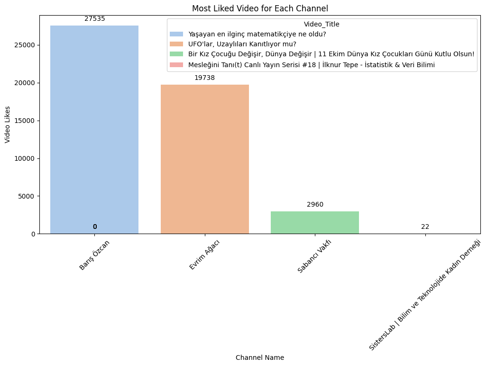
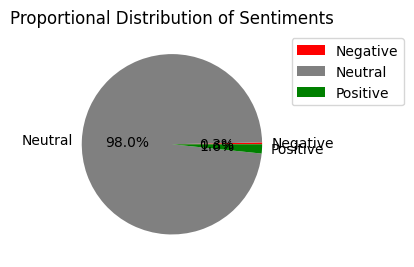

# Turkish Sentiment Analysis Project

Bu proje, YouTube yorumları üzerinde duygu analizi yapmayı amaçlamaktadır. Projede, farklı kelime temsil modelleri kullanılarak bir metnin duygusal tonunun belirlenmesi için makine öğrenmesi modelleri geliştirilmiştir.

## Projeyi Çalıştırma

Projeyi çalıştırmak için aşağıdaki adımları takip edebilirsiniz:

Python 3.11.3 versiyonu kullanılmıştır.

1. Gerekli kütüphaneleri yükleyin:

    ```bash
    pip install -r requirements.txt
    ```

2. YouTube API ile yorumları çekme methodlarını uygulamak için:

    ```bash
    pip install google-api-python-client
    ```

    ve YOUTUBE_API Key e sahip olmanız gerekir. [YOUTUBE_API Key](https://medium.com/@seherkumsar/veri-biliminde-api-kullan%C4%B1m%C4%B1-7b21aa28f3d9) Key almak için blog yazımı okuyabilirsiniz 😊

## Proje Dosyaları

- **[data](data/)**: Veri setleri
- **[api_methods.py](api_methods.py)**: Youtube API için metodlar
- **[config.py](config.py)**: Youtube API Key bilgisi
- **[requirements.txt](requirements.txt)**: Gerekli kütüphaneler

## Proje Aşamaları:

**1. Veri Seti Hazırlığı:**
Veri setini toplayın ve temizleyin. CSV formatında bir dosya kullanılabilir.

**2. Kelime Temsil Modelleri Eğitimi:**
Count Vectors, TF-IDF Vectors, Word2Vec, FastText gibi kelime temsil modelleri eğitildi.

**3. Makine Öğrenmesi Modelleri:**
Eğitilen kelime temsil modelleri kullanılarak makine öğrenmesi modelleri (örneğin, Naive Bayes, SVM, Random Forest) eğitildi. Eğitim süreci, metin verileri üzerinde duygu durumunu tahmin etmek için model öğrenmesini içerir.

**4. Sonuçların Değerlendirilmesi:**
Eğitim veri seti kullanılarak eğitilen model test veriseti test edilir. Modelin performansı, doğruluk skoru ve sınıflandırma raporu kullanılarak değerlendirilir.

**5. YouTube Yorumlarının Duygu Analizi:**
YouTube API kullanılarak veri toplanır ve toplanan veriler kullanılarak her yorumun olumlu, olumsuz veya tarafsız bir duygu durumu içerip içermediğini belirleyen bir duygu analizi yapılır. Duygu analizi sonuçları, veri setindeki yorumlara eklenir.



**6. Sonuçların Görselleştirilmesi:**
Duygu analizi sonuçlarını grafiklerle görselleştirilir.



## Kullanılan Kütüphaneler

- scikit-learn
- pandas
- numpy
- transformers
- textblob
- matplotlib
- seaborn
- gensim
- wordcloud

## Lisans

Bu proje [MIT Lisansı](LICENSE) altında lisanslanmıştır.
